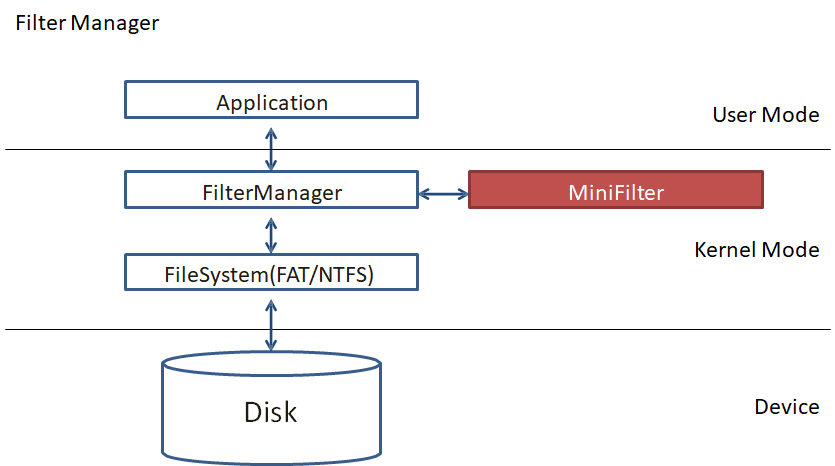
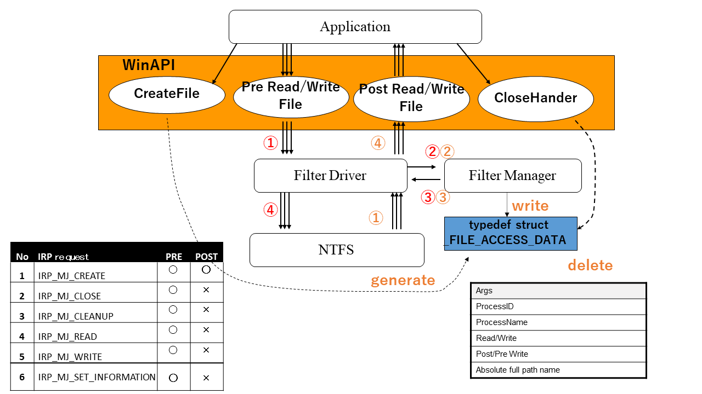
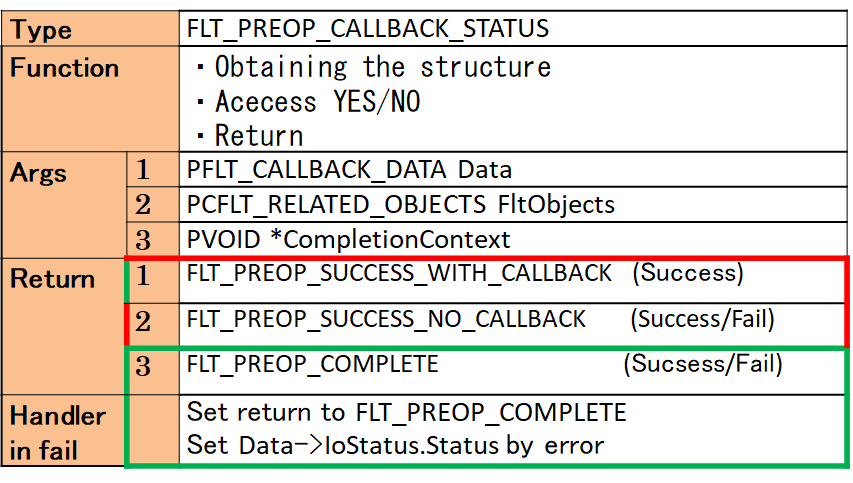
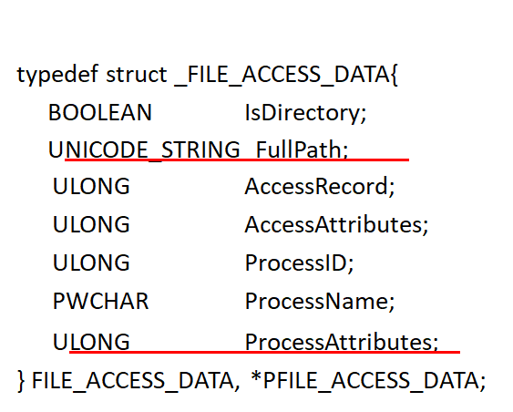

# DetectZ - Windows File System Filter Driver for simple access control

# Where to work...

# How it works...

# What is it...

# What is available for simple access control...

# Links (Japanese)

https://www.slideshare.net/RuoAndo/tcg-first-publicworkshopruoando
https://www.slideshare.net/RuoAndo/css2009-ruo-ando

