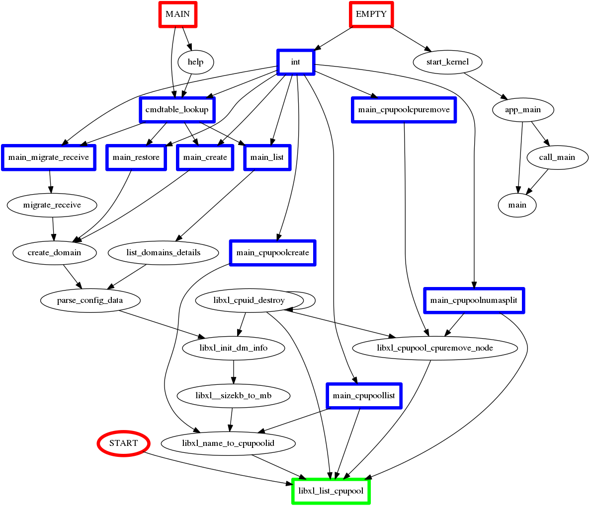
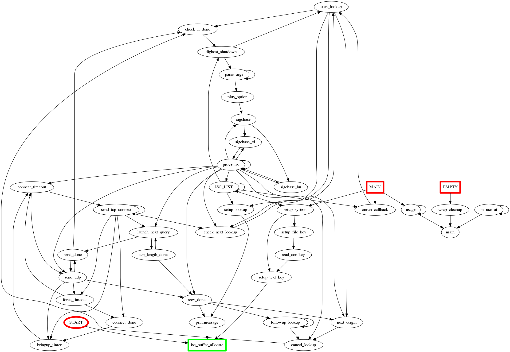

# path searh

listing databases.

<pre>
bash# python databases.py
template1
postgres
xen461
</pre>

path search. 

<pre>
bash# python ex-list.py xen461 libxl_list_cpupool 6
</pre>

<pre>
libxl_list_cpupool,START
libxl_cpupool_cpuremove_node,3154,libxl_list_cpupool,3163,tools/libxl/libxl.c
libxl_cpuid_destroy,212,libxl_cpupool_cpuremove_node,561,tools/libxl/libxl.h
main_cpupoolcpuremove,5683,libxl_cpupool_cpuremove_node,5733,tools/libxl/xl_cmdimpl.c
EMPTY,int,/home/flare/Saturator/path-search
*cmdtable_lookup,390,main_migrate_receive,135,tools/libxl/xl_cmdtable.c
EMPTY,*cmdtable_lookup,/home/flare/Saturator/path-search
</pre>

