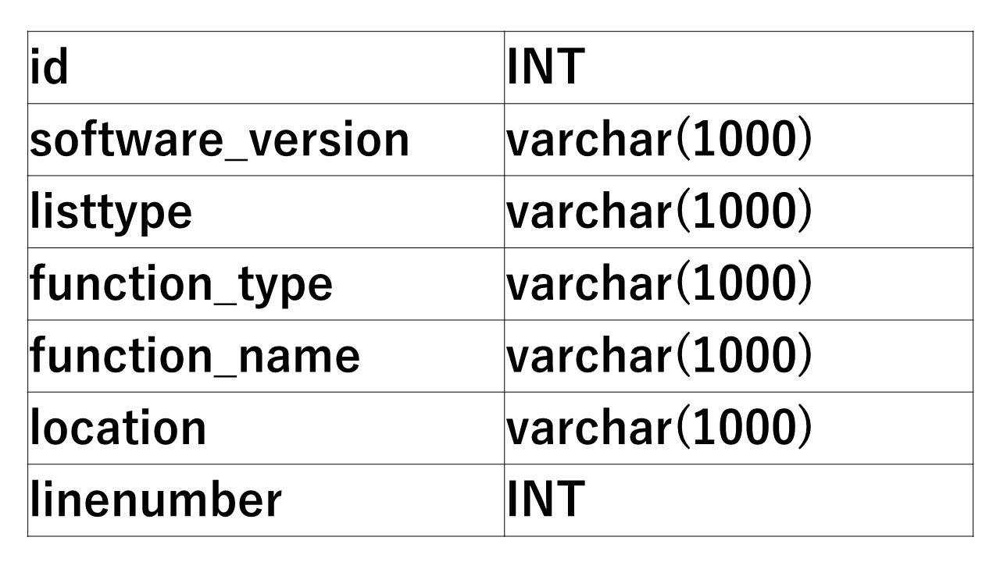
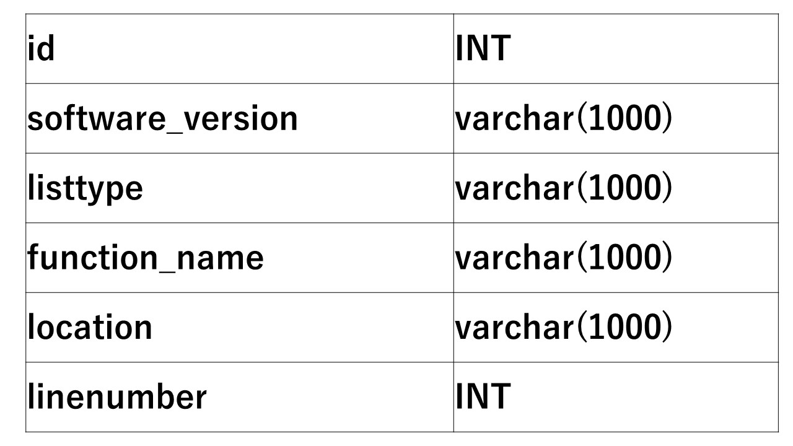

# installing PostgreSQL on Ubuntu.

<pre>
bash# apt-get install postgresql
bash# apt-get install python-psycopg2
bash# cp pg_hba.conf /etc/postgresql/9.5/main/pg_hba.conf

bash# diff pg_hba.conf /etc/postgresql/9.5/main/pg_hba.conf

>
82c92
< host    all             all             127.0.0.1/32            trust
---
> host    all             all             127.0.0.1/32            md5
84c94

bash# python createdb.py
bash# python pg_stat_database.py
datid |  datname   | numbackends | xact_commit | xact_rollback | blks_read  |  blks_hit   | tup_returned | tup_fetched | tup_inserted | tup_updated | tup_deleted | conflicts | temp_files |  temp_bytes  | deadlocks | blk_read_time | blk_write_time | stats_reset | size
---
dataid -- 16384
datname -- sample
numbackends -- 1
xact_commit -- 4
blks_read -- 0
blks_hit -- 118
tup_returned -- 1155
tup_fetched -- 680
tup_inserted -- 578
tup_updated -- 38
tup_deleted -- 1
conflicts -- 0
temp_files -- 0
temp_bytes -- 0
deadlocks -- 0
blk_read_time -- 0
blk_write_time -- 0.0
starts_reset -- 0.0
size -- 2016-12-29 17:37:43.504708+09:00 
</pre>

# definition table

<pre>
sql = "create TABLE definition(id INT, software_version varchar(1024), listtype varchar(1024), function_type varchar(1024), function_name varchar(1024), location varchar(1024), linenumber INT);"  
</pre>

# callchain table

<pre>
sql = "create TABLE callchain(id INT, software_version varchar(1024), listtype varchar(1024), function_name varchar(1024), location varcha\
r(1024), linenumber INT);"
</pre>

# ex table

<pre>
sql = "INSERT INTO ex (id, software_version, caller_name, caller_linenumber, callee_name, callee_linenumber, location) VALUES (" + str(counter) + ", '" + software_version + "', '" + tmpcaller[0] + "', '" + str(caller_ln) + "', '" +tmpcallee[0] + "', '" + str(callee_ln) + "', '" + str(location) +"');"
</pre>

