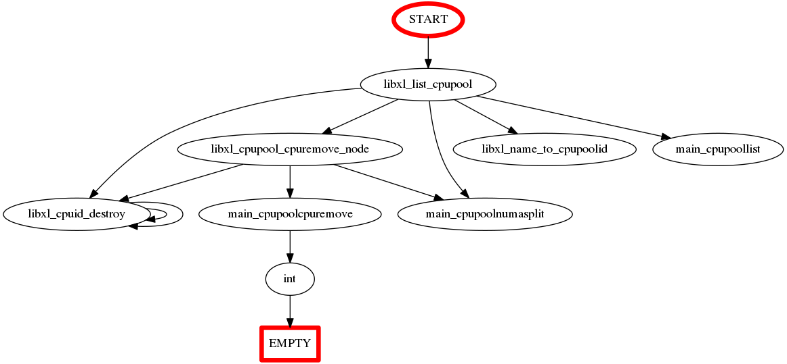
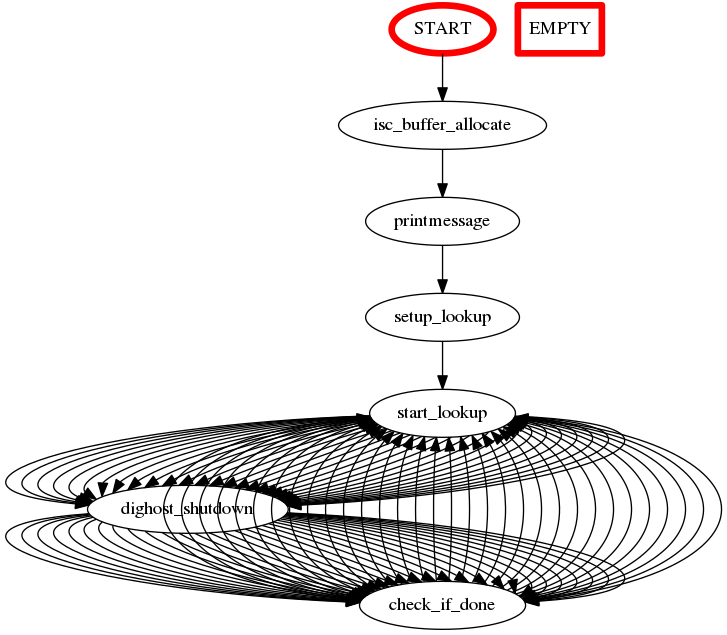
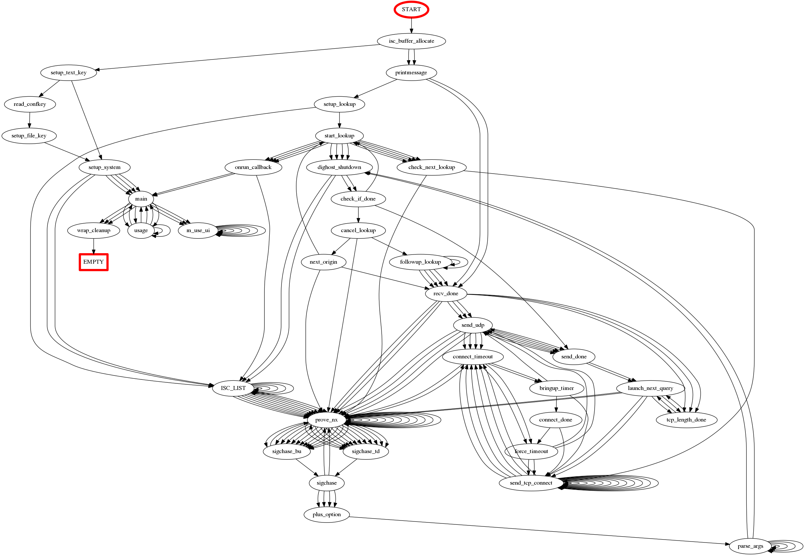

# enumerating and visualizing callgraph

CVE-2013-4371
https://wiki.xenproject.org/wiki/Cpupools_Howto

<pre>
 bash# python ex-list.py xen414 libxl_list_cpupool > tmp
 bash# cd viz

 2079  python 1.py tmp > tmp2
 2080  dot -Tpng tmp2 -o tmp2.png
 2081  eog tmp2.png
</pre>

CVE-2016-2775
https://kb.isc.org/article/AA-01393/74/CVE-2016-2775%3A-A-query-name-which-is-too-long-can-cause-a-segmentation-fault-in-lwresd.html

<pre>
 bash# python ex-list.py bind999b1 isc_buffer_allocate > tmp /
</pre>

LIMIT = 3

LIMIT = 7

