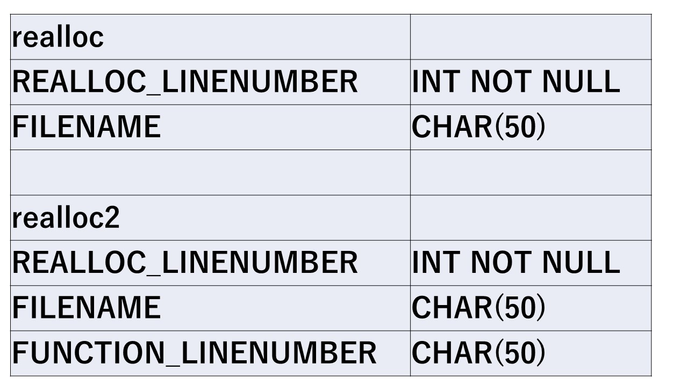
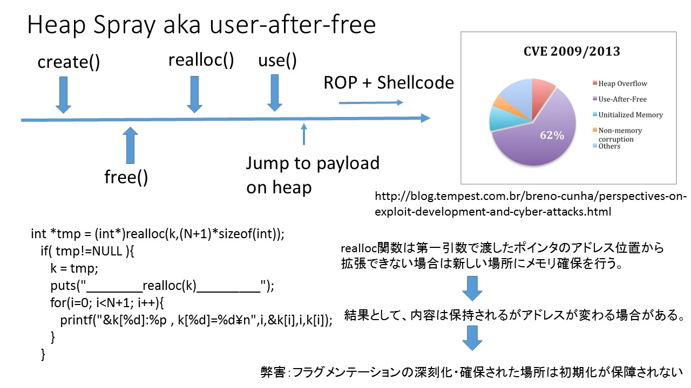
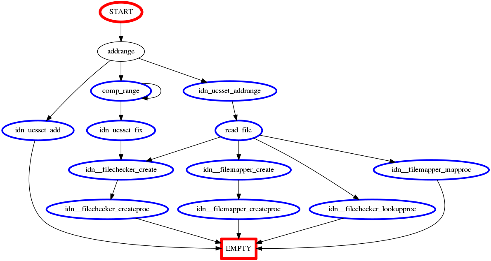
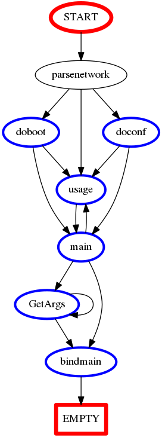

# install

<pre>
bash# apt-get install libpqxx-dev
bash# g++ 1.cpp -lpqxx -lpq
</pre>

# Table layout

<pre>
sql = "CREATE TABLE COMPANY("  \
"REALLOC_LINENUMBER     INT     NOT NULL," \
"FUNCTION_NAME           CHAR(50)," \
"FUNCTION_LINENUMBER CHAR(50));";
</pre>

# mitigating heap-spray

<pre>
bash# python realloc-show.py
bash# python select.py bind941
bash# python ex-list.py bind941 addrange | tee tmp
bash# cp tmp Saturator/postgres/viz/
bash# cd Saturator/postgres/viz
bash# do.sh
</pre>

