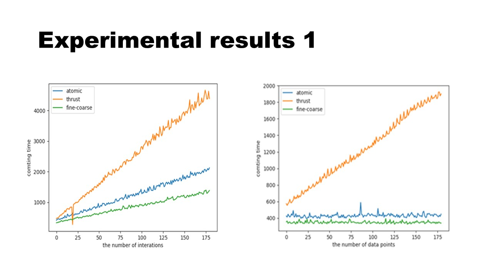

# Clustering (K-Means) with CUDA Thrust

STEP1: Building binaries

<pre>
# ./build-traverse.sh multi
# ./build-gpu.sh km-thrust
# ./build.sh aipr
</pre>

STEP2: Generating data

<pre>
# ./aipr 10000
# wc -l random_data.txt
10000 random_data.txt
</pre>

STEP3: Preparing data

<pre>
# split -l 1000 random_data.txt
# ls x*
xaa  xab  xac  xad  xae  xaf  xag  xah  xai  xaj
</pre>

<pre>
# mkdir tmp-box
# mv x* tmp-box
# ls tmp-box
xaa  xab  xac  xad  xae  xaf  xag  xah  xai  xaj
</pre>

STEP4: Reduction

<pre>
# time ./multi tmp-box/

real    0m5.679s
user    0m0.739s
sys     0m4.860s

# head -n 3 tmp-1
2019-07-02 00:00:00.027,841
2019-07-02 00:00:00.198,784
2019-07-02 00:00:00.354,912
# head -n 3 tmp-2
2019-07-02 00:00:00.027,25846
2019-07-02 00:00:00.198,52326
2019-07-02 00:00:00.354,12947

# wc -l tmp-1
9972 tmp-1
# wc -l tmp-2
9972 tmp-2
</pre>

STEP5: Clustering

<pre>
# time ./km-thrust tmp-1 tmp-2 9972

real    0m4.855s
user    0m0.253s
sys     0m4.378s

# head -n 3 clustered
2019-07-02 00:00:00.027,493,27944, cluster4,(0.0961693%)
2019-07-02 00:00:00.198,574,23719, cluster0,(0.0976735%)
2019-07-02 00:00:00.354,311,48552, cluster2,(0.0999799%)
</pre>

# Experimental result

At first, generate random data.

<pre>
# time python rand7.py 6 2000000 > data2

real    0m36.448s
user    0m37.805s
sys     0m4.848s

# wc -l data2
6000000 data2

# head -n 5 data2
-1.0856306033005612,0.9973454465835858,0.28297849805199204,-1.506294713918092,-0.5786002519685364,1.651436537097151
-2.426679243393074,-0.42891262885617726,1.265936258705534,-0.8667404022651017,-0.6788861516220543,-0.09470896893689112
1.4913896261242878,-0.638901996684651,-0.44398195964606546,-0.43435127561851733,2.2059300827254558,2.1867860889737867
1.004053897878877,0.386186399174856,0.7373685758962422,1.490732028150799,-0.9358338684023914,1.1758290447821034
-1.2538806677490124,-0.6377515024534103,0.9071051958003012,-1.428680700225969,-0.1400687201886661,-0.8617548958596855
</pre>

Building binaries.

<pre>
# ./build-gpu.sh atomic
# ./build-gpu.sh fine-coarse
# ./build-gpu.sh thrust
</pre>

Script for automating plots.

<pre>
#!/bin/bash

./build-gpu.sh atomic
./build-gpu.sh fine-coarse
./build-gpu.sh thrust

#./a.out file data 1000 1000 3

MAX=100000
INTVL=500

echo "atomic"

rm -rf atomic.csv
touch atomic.csv

COUNT=10000
while [ $COUNT -lt $MAX ]; do
    rslt=`./atomic data2 10000 ${COUNT} 3`
    echo $rslt","$COUNT | tee -a atomic.csv
    COUNT=`expr $COUNT + $INTVL` # COUNT をインクリメント    
done

rm -rf fine-coarse.csv
touch fine-coarse.csv

echo "fine-coarse"
COUNT=10000
while [ $COUNT -lt $MAX ]; do
    rslt=`./fine-coarse data2 10000 ${COUNT} 3`
    echo $rslt","$COUNT | tee -a fine-coarse.csv
    COUNT=`expr $COUNT + $INTVL` # COUNT をインクリメント    
done

echo "thrust"
rm -rf thrust.csv
touch thrust.csv

COUNT=10000
while [ $COUNT -lt $MAX ]; do
    rslt=`./thrust data2 1000 ${COUNT} 3`
    echo $rslt","$COUNT | tee -a thrust.csv
    COUNT=`expr $COUNT + $INTVL` # COUNT をインクリメント
done

python plot3.py atomic.csv fine-coarse.csv thrust.csv 
cp plot3.png plot3.iter.png

</pre>